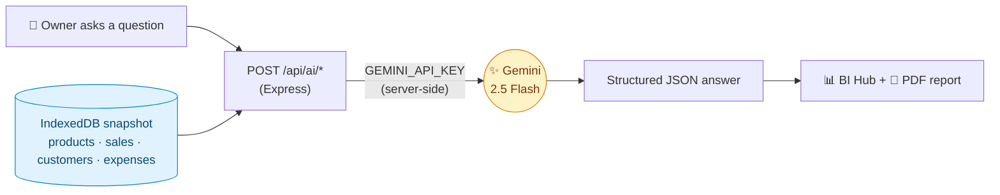
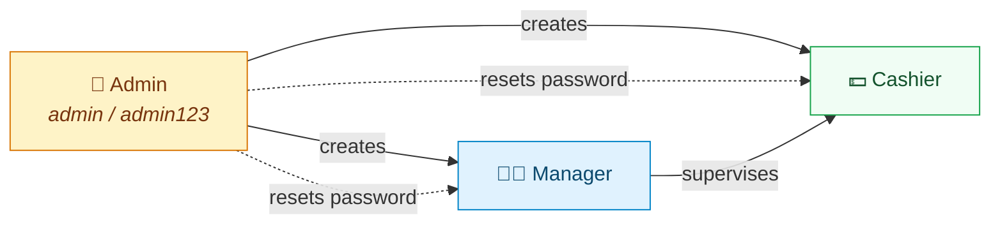
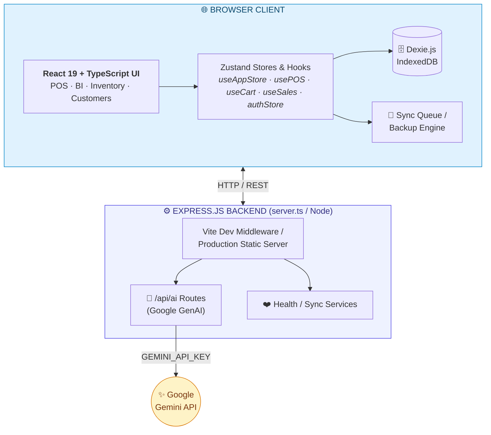
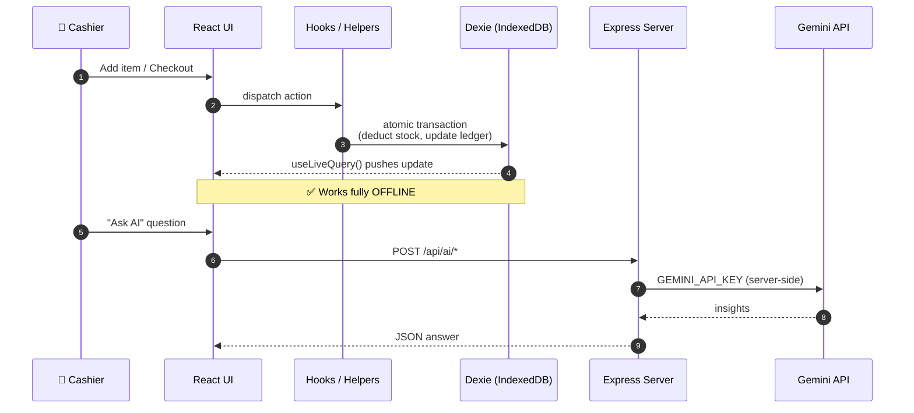

<!-- =====================================================================
     🛒  SHOP MANAGEMENT SYSTEM & POS TERMINAL — Premium README
     ---------------------------------------------------------------------
     ✅ ZERO-CONFIG: every image loads from Shields.io / placehold.co, or is
        a native GitHub Mermaid diagram. Nothing to upload.

     🎨 BEFORE YOU PUBLISH — replace:
        1. 🔍 search "REPLACE_LIVE_URL"  → your real deployed link
        2. 🤖 paste your exact prompt from src/services/AIReportService.ts

     🖼️  TO USE REAL SCREENSHOTS (optional, 30s each):
        Create assets/ and swap the matching placehold.co URL:
        Hero / "POS Terminal" → assets/pos-terminal.png
        "BI Dashboard"        → assets/dashboard.png
        "Inventory"           → assets/inventory.png
        "Customers"           → assets/customers.png
        "Cloud Sync"          → assets/cloud-sync.png
        "Secure Auth"         → assets/login.png
===================================================================== -->

<div align="center">


# 🛒 Shop Management System & POS Terminal

### *Offline‑First · AI‑Powered · Blazing Fast*

An ultra‑speed, **offline‑first** Point‑of‑Sale terminal and full **Business Intelligence** suite —
built with **React 19 · TypeScript · Tailwind CSS v4 · Dexie.js (IndexedDB) · Google Gemini AI**.

<br/>


<br/><br/>

<!-- ⚠️ REPLACE_LIVE_URL -->
[](https://shop-pos.vercel.app)
[](https://github.com/YOUR_USERNAME/YOUR_REPO)

</div>

> [!IMPORTANT]
> ### 🔗 Live Application
> **➡️ [https://shop-pos.vercel.app](https://shop-pos.vercel.app)** <!-- ⚠️ REPLACE_LIVE_URL -->
>
> 🔑 **Login →** Username `admin` · Password `admin123`
> 📴 *Offline‑first: all data lives in your browser's IndexedDB and syncs when you reconnect.*

---

## 📊 At a Glance

<table>
<tr>
<td align="center" width="20%">📴<br/><br/><b>100%</b><br/><sub>OFFLINE-FIRST</sub></td>
<td align="center" width="20%">🤖<br/><br/><b>Gemini 2.5</b><br/><sub>AI ANALYTICS</sub></td>
<td align="center" width="20%">⚡<br/><br/><b>&lt;1s</b><br/><sub>UI RESPONSE</sub></td>
<td align="center" width="20%">🧩<br/><br/><b>6+</b><br/><sub>BUSINESS MODULES</sub></td>
<td align="center" width="20%">🔐<br/><br/><b>3</b><br/><sub>USER ROLES</sub></td>
</tr>
</table>

<br/>

<div align="center">

### 📖 Overview


</div>

> Run an entire shop from a single browser tab. Sell, track inventory, manage credit, and generate **AI‑written financial reports** — *even with the internet unplugged.* When you reconnect, everything syncs.

<table>
<tr>
<td width="50%">

**⚡ Why it's different**
- 🚀 **Sub‑second** UI on commodity hardware
- 📴 **100 % offline** — IndexedDB is the source of truth
- 🤖 **Gemini‑powered** BI assistant & report writer
- ⌨️ **Hotkey‑first** cashier workflow (F1–F9)
- 🧾 **Pixel‑perfect** thermal receipt printing

</td>
<td width="50%">

**🎯 Built for**
- 🏪 Retail & grocery shops
- ☕ Cafés & quick‑service counters
- 📦 Wholesale & credit‑based trade
- 📊 Owners who want **real** analytics
- 🌍 Regions with **unreliable internet**

</td>
</tr>
</table>

---

## 🧭 Table of Contents

<div align="center">

[🖼️ Screenshots](#-screenshots) · [✨ Features](#-core-features) · [🤖 AI](#-the-ai-feature) · [🔐 Access](#-access--roles) · [🏗️ Architecture](#️-architecture) · [⚡ Data Flow](#-data-flow--persistence) · [🛠️ Stack](#️-tech-stack) · [📁 Structure](#-project-structure) · [🚀 Run](#-getting-started) · [📦 Build](#-production-build) · [⌨️ Shortcuts](#️-keyboard-shortcuts) · [📄 License](#-license)

</div>

<br/>

<div align="center">

### 🖼️ Screenshots


</div>

> *Styled placeholders — replace each with your own PNG via the mapping at the top of this file.*

<div align="center">
<table>
<tr>
<td align="center" width="50%"><br/><sub><b>🛒 POS Terminal</b><br/>Grid · cart · multi‑pay</sub></td>
     
<td align="center" width="50%">
     
     <br>

<br>

<br>

<br>

<br>

<br>

<br>

<br>


     
  <br/><sub><b>📊 BI & AI Analytics</b><br/>KPIs · charts · Gemini</sub></td>
</tr>
<tr>
<td align="center"><br/><sub><b>📦 Inventory & Catalog</b><br/>SKU · stock · reorder</sub></td>


     
<td align="center">
     
     <br>
     
<br>

<br>
     
<br>

<br/><sub><b>👥 Customers & Credit</b><br/>ledger · limits · loyalty</sub></td>
</tr>
<tr>
<td align="center"><br/><sub><b>☁️ Cloud Sync & Backup</b><br/>queue · export · restore</sub></td>
<td align="center"><br/><sub><b>🔐 Role‑Based Auth</b><br/>login · guards · roles</sub></td>
</tr>
</table>
</div>

<br/>

<div align="center">

### ✨ Core Features


</div>

<table>
<tr>
<td width="33%" valign="top">

**🛒 POS Cashier**
Live product grid, instant search, barcode scanner, favorites, dynamic tax & discount engine, multi‑payment settlement *(Cash · Card · Wallet · Credit)*.

</td>
<td width="33%" valign="top">

**📊 BI & AI Analytics**
Ask business questions in plain English. Gemini 2.5 Flash returns insights, stock alerts, projections & **auto‑generated PDF reports**.

</td>
<td width="33%" valign="top">

**📦 Inventory**
SKU & barcode generation, cost vs. sell price, reorder thresholds, low‑stock warnings, atomic stock deduction on checkout.

</td>
</tr>
<tr>
<td valign="top">

**👥 Customers & Credit**
Lifetime spend tracking, loyalty history, full credit ledger, payment logs, **automatic credit‑limit enforcement**.

</td>
<td valign="top">

**🚚 Suppliers & Purchases**
Supplier profiles, purchase orders, inventory intake, accounts‑payable records — all linked to stock movements.

</td>
<td valign="top">

**💰 Expenses & ☁️ Sync**
Categorized & recurring expenses with attachments. Offline queue, JSON/CSV backup, restore wizard, integrity checks.

</td>
</tr>
</table>

<br/>

<div align="center">

### 🤖 The AI Feature


</div>

The built‑in **"Shop Mind"** assistant turns live shop data into decisions, powered by **Google Gemini 2.5 Flash**:

- 💬 Answers plain‑English questions — *"Which products should I reorder this week?"*
- 🚨 Flags **low / out‑of‑stock items**, **dead stock**, **fast movers**, and **customers near their credit limit**
- 📈 Produces short **demand & revenue projections** with stated assumptions
- 📝 Writes **executive‑summary PDF reports** → `headline · key metrics · insights · risks · actions`

> [!TIP]
> 🔐 The AI **never touches the browser directly**. The client calls `/api/ai/*`, and the **Express server injects `GEMINI_API_KEY` server‑side** — so your key is never exposed.



**📜 The system prompt behind it** *(see `src/services/AIReportService.ts`)*:

```text
You are "Shop Mind", the embedded business-intelligence analyst inside the
Shop Management System — an offline-first POS used by a small retail shop.

CONTEXT
You receive a JSON snapshot of the shop's live data: products (with stock
levels & reorder thresholds), recent sales, customers (with credit balances),
suppliers, purchases and expenses. Treat this snapshot as the ONLY source of truth.

TASKS
1. Answer the owner's plain-English questions about the business.
2. Proactively surface: low/out-of-stock items, fast movers, dead stock,
   customers near their credit limit, unusual spend, and margin erosion.
3. Produce short projections (next-7-day demand, expected revenue) with assumptions.
4. When asked for a "report", return a structured executive summary:
   { headline, key_metrics[], insights[], risks[], actions[] }.

RULES
- NEVER invent numbers. If the data doesn't support an answer, say so and
  state exactly what is missing.
- Always format money with the shop's currency symbol and 2 decimals.
- Quantify everything ("revenue down 12% vs last week", not "revenue down").
- Rank recommendations by impact; keep each to a single line.
- Be concise and practical — write for a busy shop owner, not a data analyst.
- If a question is outside the provided data, reply:
  "I can't see that in your shop data."
```

<br/>

<div align="center">

### 🔐 Access & Roles


</div>

> [!WARNING]
> **Security:** Change the default password immediately after first login in any real deployment.

<div align="center">

| Role | Username | Password | Scope |
|:---:|:---:|:---:|:---|
| 👑 **Admin** | `admin` | `admin123` | Full access · User management · **Resets Manager & Cashier passwords** |
| 🧑‍💼 **Manager** | *(by Admin)* | *(by Admin)* | Inventory · Purchases · Reports · Customers |
| 💵 **Cashier** | *(by Admin)* | *(by Admin)* | POS · Sales · Customer lookup |

</div>

> 🔑 **Only the Admin** can create users and reset the passwords of Managers and Cashiers.



<details>
<summary><b>🔑 Full permission matrix</b></summary>

| Feature | 👑 Admin | 🧑‍💼 Manager | 💵 Cashier |
|---------|:---:|:---:|:---:|
| POS Terminal / Sales | ✅ | ✅ | ✅ |
| Customer Management | ✅ | ✅ | 👁️ View only |
| Inventory & Products | ✅ | ✅ | ❌ |
| Purchases & Suppliers | ✅ | ✅ | ❌ |
| Expenses | ✅ | ✅ | ❌ |
| BI Dashboard & Reports | ✅ | ✅ | ❌ |
| Cloud Sync & Backup | ✅ | ❌ | ❌ |
| User Management | ✅ | ❌ | ❌ |
| **Change Manager/Cashier Password** | ✅ | ❌ | ❌ |
| System Settings | ✅ | ❌ | ❌ |

</details>

<br/>

<div align="center">

### 🏗️ Architecture


</div>

A **hybrid, client‑centric, offline‑first** design. The browser owns the data; the Express server only serves files, proxies AI calls, and guards secrets.



<br/>

<div align="center">

### ⚡ Data Flow & Persistence


</div>



- **Offline‑first:** Products, Sales, Customers, Expenses & Purchases live in IndexedDB — **100 % functional** without internet.
- **Reactive reads:** components subscribe via `useLiveQuery`.
- **Atomic writes:** helpers (e.g. `salesHelper.ts`) deduct stock and update credit ledgers in one transaction.
- **Secure AI:** keys never touch the client — the browser calls `/api/ai/*`, the server injects `GEMINI_API_KEY`.

<br/>

<div align="center">

### 🛠️ Tech Stack


</div>

<div align="center">

**Frontend**


**State · Data · Motion**


**Backend · AI · Export**


</div>

<br/>

<div align="center">

### 📁 Project Structure


</div>

```text
shop-management-system/
 ├── server.ts                 # Express backend + Vite dev middleware
 ├── index.html                # Web entry template
 ├── metadata.json             # Applet config & metadata
 ├── package.json              # Dependencies & scripts
 ├── vite.config.ts            # Vite build config
 ├── tsconfig.json             # TS compiler config
 ├── .env.example              # Env variable docs
 │
 └── src/
     ├── main.tsx              # React bootstrap & DOM mount
     ├── App.tsx               # Router & Providers
     ├── assets/               # Fonts, audio, images, icons
     ├── config/               # Branding & theme
     ├── constants/            # Enums & system constants
     ├── contexts/             # AppearanceContext, PrintContext
     ├── database/             # Dexie schema + helpers
     │   ├── db.ts             # DB instance & tables
     │   ├── dbSeeder.ts       # Default data seeder
     │   ├── salesHelper.ts    # POS transactions
     │   ├── productHelper.ts  # Product & stock
     │   └── customerHelper.ts # Customer & credit
     ├── hooks/                # usePOS · useCart · useSales · useAuth · usePDF · usePrint …
     ├── layouts/              # Main · Dashboard · Auth layouts
     ├── pages/                # Sales · Products · Customers · Purchases · Expenses · CloudSync · Dashboard
     ├── components/
     │   ├── ai/               # AI assistant drawer & reports
     │   ├── auth/             # Login · ProtectedRoute · RoleGuard
     │   ├── common/           # MotionComponents · Toast · Breadcrumb
     │   ├── dashboard/        # BiAnalyticsHub · KpiGrid · Charts
     │   ├── pos/new/          # ProductGrid · PaymentPanel · BillSummary · CartCard · POSHeader
     │   └── ui/               # Buttons · Modals · Inputs · Badges
     ├── routes/router.tsx     # React Router definitions
     ├── services/             # AIReportService · PDFService · SyncService
     ├── store/                # useAppStore · authStore · uiStore
     ├── styles/               # Tailwind import + print overrides
     └── utils/                # Formatters · currency · audit logger · math
```

<br/>

<div align="center">

### 🚀 Getting Started


</div>

**✅ Prerequisites** — Node.js ≥ `v18.x` · npm ≥ `v9.x` · a [Gemini API key](https://aistudio.google.com/apikey)

**① Clone & install**
```bash
git clone https://github.com/YOUR_USERNAME/YOUR_REPO.git
cd YOUR_REPO
npm install
```

**② Configure environment**
```bash
cp .env.example .env
```
```env
GEMINI_API_KEY="your_google_gemini_api_key_here"
APP_URL="http://localhost:3000"
```

**③ Run the dev server**
```bash
npm run dev          # 🌐 open http://localhost:3000
```

**④ Login** → `admin` / `admin123`

> [!NOTE]
> ☁️ **To get your live URL:** deploy `dist/` to **Vercel / Netlify / Render**, set `GEMINI_API_KEY` in the host's env vars, then paste the URL into the **LIVE_DEMO** badge at the top.

<br/>

<div align="center">

### 📦 Production Build


</div>

```bash
npm run build      # vite build  +  esbuild server.ts → dist/server.cjs
npm start          # node dist/server.cjs  (serves on :3000)
```

| Step | Command | Output |
|------|---------|--------|
| Client bundle | `vite build` | `dist/` (static assets) |
| Server bundle | `esbuild server.ts` | `dist/server.cjs` (CommonJS) |
| Launch | `npm start` | `node dist/server.cjs` |

<br/>

<div align="center">

### ⌨️ Keyboard Shortcuts


</div>

The POS terminal is built for **hands‑on‑keyboard** speed.

<div align="center">

| Key | Action | | Key | Action |
|:---:|--------|---|:---:|--------|
| `F1` | Quick product search | | `F8` | Open checkout modal |
| `F2` | Focus barcode scanner | | `F9` | Quick **cash** sale |
| `F3` | Select / add customer | | `Esc` | Close dialog / clear |
| `F4` | Apply order discount | | | |

</div>

<br/>

<div align="center">

### 📄 License


</div>

> [!CAUTION]
> This project is **proprietary** and built for enterprise shop management, cashier POS operations, and data analytics. **All rights reserved.**

---

<div align="center">

### 💙 Built with caffeine, TypeScript & a love for offline‑first design

**Shop Management System & POS Terminal**

<br/>

<sub>⭐ Star the repo if you find it useful!</sub>

</div>

<!-- =====================================================================
     OPTIONAL: Star History chart.
     NOT rendered by default (a placeholder repo would show a broken image).
     When your repo is public, paste this block OUTSIDE the comment and
     replace YOUR_USERNAME / YOUR_REPO:

<a href="https://star-history.com/#YOUR_USERNAME/YOUR_REPO&Date">
 <picture>
   <source media="(prefers-color-scheme: dark)" srcset="https://api.star-history.com/svg?repos=YOUR_USERNAME/YOUR_REPO&type=Date&theme=dark" />
   
 </picture>
</a>
===================================================================== -->
