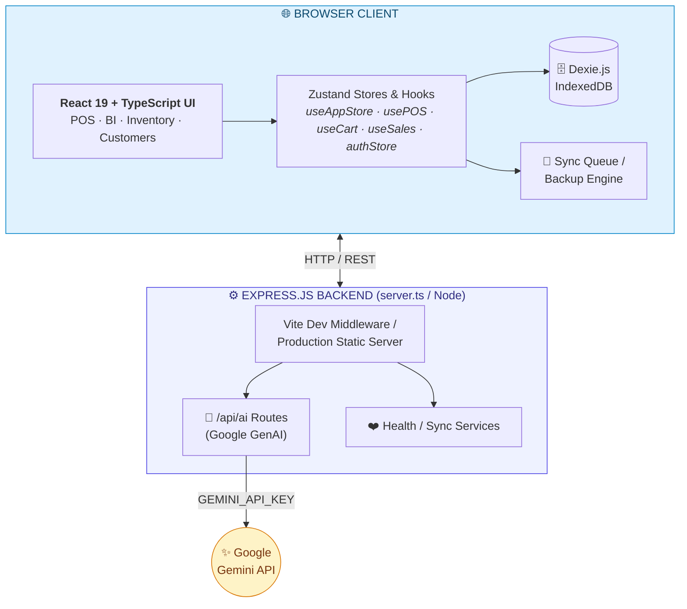
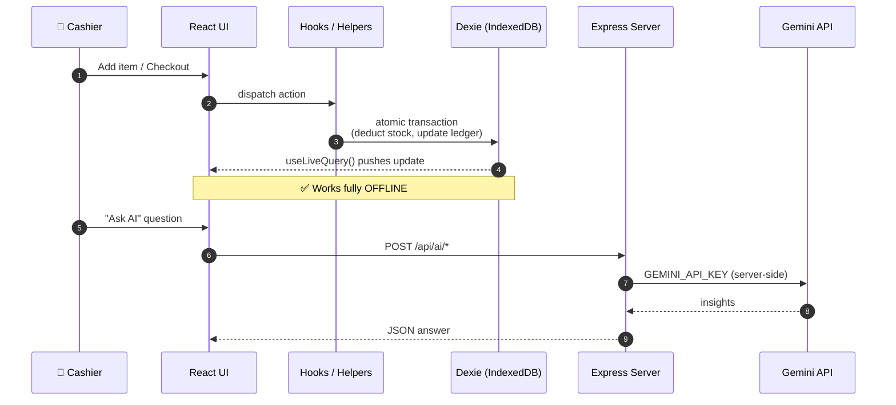

<!-- =====================================================================
     🎨  SHOP MANAGEMENT SYSTEM & POS TERMINAL — GitHub README
     ---------------------------------------------------------------------
     📁 IMAGE SETUP (do this once after pushing):
        1. Create a folder:  assets/
        2. Add these files (screenshots of your app):
           - assets/pos-terminal.png   ← the hero image you already have
           - assets/dashboard.png
           - assets/inventory.png
           - assets/customers.png
           - assets/cloud-sync.png
           - assets/login.png
        3. Replace  YOUR_USERNAME / YOUR_REPO  below with your real values.
     All other graphics (badges, banner, icons, star chart) are live
     services and need NO hosting.
===================================================================== -->

<!-- ============================  HEADER BANNER  ============================ -->
<div align="center">


<!-- typing subtitle -->
<a href="#"></a>

</div>

<!-- ============================  BADGE ROW  ============================ -->
<div align="center">


<br/>


</div>

---

<!-- ============================  HERO SCREENSHOT  ============================ -->
<div align="center">

### 🖥️ The Terminal, Reimagined


<sub>A tactile, keyboard‑driven cashier experience with live cart, multi‑payment checkout, and instant product search.</sub>

</div>

---

## 📖 Overview

> An **ultra‑speed, offline‑first** Point of Sale (POS) terminal and comprehensive **Business Intelligence (BI)** suite — engineered with **React 19**, **TypeScript**, **Tailwind CSS v4**, **Dexie.js (IndexedDB)**, and **Google Gemini AI**.

Run an entire shop from a single browser tab. Sell, track inventory, manage credit, and generate AI‑driven financial reports — **even with the internet unplugged**. When you're back online, everything syncs seamlessly.

<table>
<tr>
<td width="50%">

### ⚡ Why it's different
- 🚀 **Sub‑second** UI on commodity hardware
- 📴 **100 % offline** — IndexedDB is the source of truth
- 🤖 **Gemini‑powered** BI assistant & report writer
- ⌨️ **Hotkey‑first** cashier workflow (F1–F9)
- 🧾 **Pixel‑perfect** thermal receipt printing

</td>
<td width="50%">

### 🎯 Built for
- 🏪 Retail & grocery shops
- ☕ Cafés & quick‑service counters
- 📦 Wholesale & credit‑based trade
- 📊 Owners who want **real** analytics
- 🌍 Regions with **unreliable internet**

</td>
</tr>
</table>

---

## 🧭 Table of Contents

- [🖼️ Screenshots](#-screenshots)
- [✨ Core Features](#-core-features)
- [🏗️ Architecture](#-architecture)
- [🛠️ Tech Stack](#-tech-stack)
- [⚡ Data Flow & Persistence](#-data-flow--persistence)
- [📁 Project Structure](#-project-structure)
- [🚀 Getting Started](#-getting-started)
- [📦 Production Build](#-production-build)
- [⌨️ Keyboard Shortcuts](#-keyboard-shortcuts)
- [📄 License](#-license)

---

## 🖼️ Screenshots

<div align="center">
<table>
<tr>
<td align="center" width="50%"><br/><sub><b>🛒 POS Terminal</b></sub></td>
<td align="center" width="50%"><br/><sub><b>📊 BI & AI Analytics</b></sub></td>
</tr>
<tr>
<td align="center"><br/><sub><b>📦 Inventory & Catalog</b></sub></td>
<td align="center"><br/><sub><b>👥 Customers & Credit</b></sub></td>
</tr>
<tr>
<td align="center"><br/><sub><b>☁️ Cloud Sync & Backup</b></sub></td>
<td align="center"><br/><sub><b>🔐 Role‑Based Auth</b></sub></td>
</tr>
</table>
</div>

---

## ✨ Core Features

<table>
<tr>
<td width="33%" valign="top">

### 🛒 POS Cashier
Live product grid, instant search, barcode scanner, favorites, dynamic tax & discount engine, and multi‑payment settlement (Cash · Card · Wallet · Credit).

</td>
<td width="33%" valign="top">

### 📊 BI & AI Analytics
Ask your business questions in plain English. Gemini 2.5 Flash returns insights, stock alerts, projections & **auto‑generated PDF reports**.

</td>
<td width="33%" valign="top">

### 📦 Inventory
SKU & barcode generation, cost vs. sell price, reorder thresholds, low‑stock warnings, and atomic stock deduction on checkout.

</td>
</tr>
<tr>
<td valign="top">

### 👥 Customers & Credit
Lifetime spend tracking, loyalty history, full credit ledger, payment logs, and **automatic credit‑limit enforcement**.

</td>
<td valign="top">

### 🚚 Suppliers & Purchases
Supplier profiles, purchase orders, inventory intake, and accounts‑payable records — all linked to stock movements.

</td>
<td valign="top">

### 💰 Expenses & ☁️ Sync
Categorized & recurring expenses with attachments. Offline queue, JSON/CSV backup, restore wizard, and integrity checks.

</td>
</tr>
</table>

---

## 🏗️ Architecture

A **hybrid, client‑centric, offline‑first** architecture. The browser owns the data; the Express server exists only to serve files, proxy AI calls, and keep secrets safe.



<details>
<summary><b>📜 Original ASCII diagram (text version)</b></summary>

```text
              +-------------------------------------------------------+
               |                      BROWSER CLIENT                   |
               |   +-----------------------------------------------+   |
               |   |            React 19 + TypeScript UI           |   |
               |   +-----------------------+-----------------------+   |
               |         Zustand Stores & Custom React Hooks           |
               |            +--------------+--------------+            |
               |            v                             v            |
               |   +-----------------+           +-----------------+   |
               |   |  Dexie.js (IDB) |           |  Sync / Backup  |   |
               |   +-----------------+           +-----------------+   |
               +---------------------------+---------------------------+
                                           |  HTTP / REST
               +---------------------------v---------------------------+
               |                  EXPRESS.JS BACKEND                   |
               |    +------------------+       +-------------------+   |
               |    |  /api/ai Routes  |       |  Health / Sync    |   |
               |    +--------+---------+       +-------------------+   |
               +-------------|-----------------------------------------+
                             v   Google Gemini API (GEMINI_API_KEY)
```
</details>

---

## 🛠️ Tech Stack

<div align="center">

</div>

| Layer | Technologies |
|-------|--------------|
| **🎨 Frontend** | React 19 · TypeScript · Vite 6 · Tailwind CSS v4 · Framer Motion · Lucide Icons · React Router v7 |
| **🧠 State & Storage** | Zustand · Dexie.js (IndexedDB) · `dexie-react-hooks` live queries |
| **📄 Export & Print** | jsPDF + autotable · PapaParse (CSV) · SheetJS (XLSX) · react‑to‑print (thermal templates) |
| **⚙️ Backend** | Express.js · `tsx` (dev) · esbuild → `dist/server.cjs` (prod) |
| **🤖 AI** | Google GenAI SDK (`@google/genai`) · `gemini-2.5-flash` |
| **📊 Charts** | Recharts |

---

## ⚡ Data Flow & Persistence



- **Offline‑first:** Products, Sales, Customers, Expenses & Purchases live in IndexedDB — the app is **100 % functional** without internet.
- **Reactive reads:** components subscribe via `useLiveQuery`.
- **Atomic writes:** helpers (e.g. `salesHelper.ts`) deduct stock and update credit ledgers in a single transaction.
- **Secure AI:** keys never touch the client — the browser calls `/api/ai/*`, the server injects `GEMINI_API_KEY`.

---

## 📁 Project Structure

```text
shop-management-system/
 ├── server.ts                 # Express backend + Vite dev middleware
 ├── index.html                # Web entry template
 ├── metadata.json             # Applet config & metadata
 ├── package.json              # Dependencies & scripts
 ├── vite.config.ts            # Vite build config
 ├── tsconfig.json             # TS compiler config
 ├── .env.example              # Env variable docs
 │
 └── src/
     ├── main.tsx              # React bootstrap & DOM mount
     ├── App.tsx               # Router & Providers
     ├── assets/               # Fonts, audio, images, icons
     ├── config/               # Branding & theme
     ├── constants/            # Enums & system constants
     ├── contexts/             # AppearanceContext, PrintContext
     ├── database/             # Dexie schema + helpers
     │   ├── db.ts             # DB instance & tables
     │   ├── dbSeeder.ts       # Default data seeder
     │   ├── salesHelper.ts    # POS transactions
     │   ├── productHelper.ts  # Product & stock
     │   └── customerHelper.ts # Customer & credit
     ├── hooks/                # usePOS · useCart · useSales · useAuth · usePDF · usePrint …
     ├── layouts/              # Main · Dashboard · Auth layouts
     ├── pages/                # Sales · Products · Customers · Purchases · Expenses · CloudSync · Dashboard
     ├── components/
     │   ├── ai/               # AI assistant drawer & reports
     │   ├── auth/             # Login · ProtectedRoute · RoleGuard
     │   ├── common/           # MotionComponents · Toast · Breadcrumb
     │   ├── dashboard/        # BiAnalyticsHub · KpiGrid · Charts
     │   ├── pos/new/          # ProductGrid · PaymentPanel · BillSummary · CartCard · POSHeader
     │   └── ui/               # Buttons · Modals · Inputs · Badges
     ├── routes/router.tsx     # React Router definitions
     ├── services/             # AIReportService · PDFService · SyncService
     ├── store/                # useAppStore · authStore · uiStore
     ├── styles/               # Tailwind import + print overrides
     └── utils/                # Formatters · currency · audit logger · math
```

---

## 🚀 Getting Started

### ✅ Prerequisites
- **Node.js** ≥ `v18.x`
- **npm** ≥ `v9.x`

### 1️⃣ Clone & install
```bash
git clone https://github.com/YOUR_USERNAME/YOUR_REPO.git
cd YOUR_REPO
npm install
```

### 2️⃣ Configure environment
```bash
cp .env.example .env
```
```env
GEMINI_API_KEY="your_google_gemini_api_key_here"
APP_URL="http://localhost:3000"
```

### 3️⃣ Run the dev server
```bash
npm run dev
```
🌐 Open **http://localhost:3000**

---

## 📦 Production Build

```bash
npm run build      # vite build  +  esbuild server.ts → dist/server.cjs
npm start          # node dist/server.cjs  (serves on :3000)
```

| Step | Command | Output |
|------|---------|--------|
| Client bundle | `vite build` | `dist/` (static assets) |
| Server bundle | `esbuild server.ts` | `dist/server.cjs` (CommonJS) |
| Launch | `npm start` | `node dist/server.cjs` |

---

## ⌨️ Keyboard Shortcuts

The POS terminal is built for **hands‑on‑keyboard** speed.

| Key | Action |   | Key | Action |
|:---:|--------|---|:---:|--------|
| `F1` | Quick product search |   | `F8` | Open checkout modal |
| `F2` | Focus barcode scanner |   | `F9` | Quick **cash** sale |
| `F3` | Select / add customer |   | `Esc` | Close dialog / clear |
| `F4` | Apply order discount |   |     |     |

---

## 🌟 Star History

<div align="center">
<a href="https://star-history.com/#YOUR_USERNAME/YOUR_REPO&Date">
 <picture>
   <source media="(prefers-color-scheme: dark)" srcset="https://api.star-history.com/svg?repos=YOUR_USERNAME/YOUR_REPO&type=Date&theme=dark" />
   <source media="(prefers-color-scheme: light)" srcset="https://api.star-history.com/svg?repos=YOUR_USERNAME/YOUR_REPO&type=Date" />
   
 </picture>
</a>
</div>

---

## 📄 License

> This project is **proprietary** and built for enterprise shop management, cashier POS operations, and data analytics. **All rights reserved.**

---

<div align="center">

### 💙 Built with caffeine, TypeScript & a love for offline‑first design


Made with ❤️ &nbsp;•&nbsp; **Shop Management System & POS Terminal**

</div>